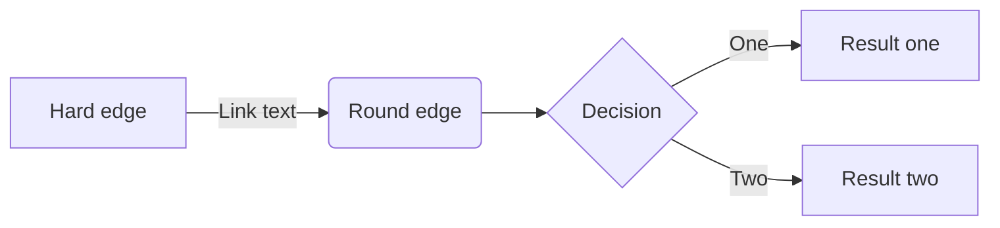
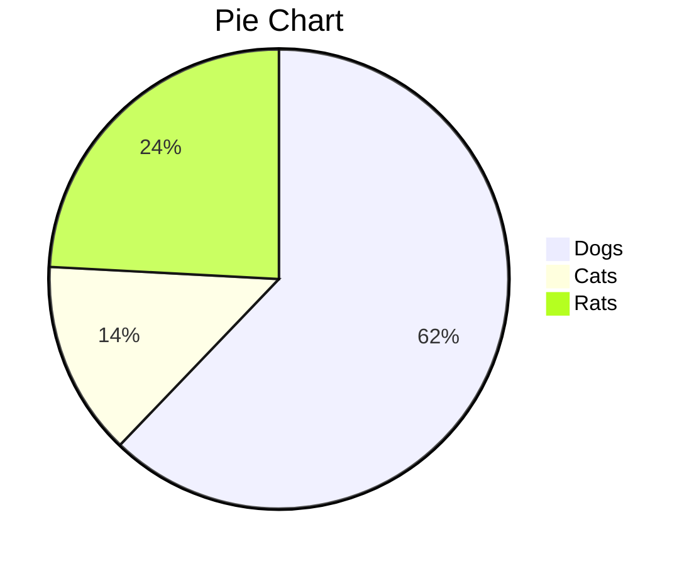
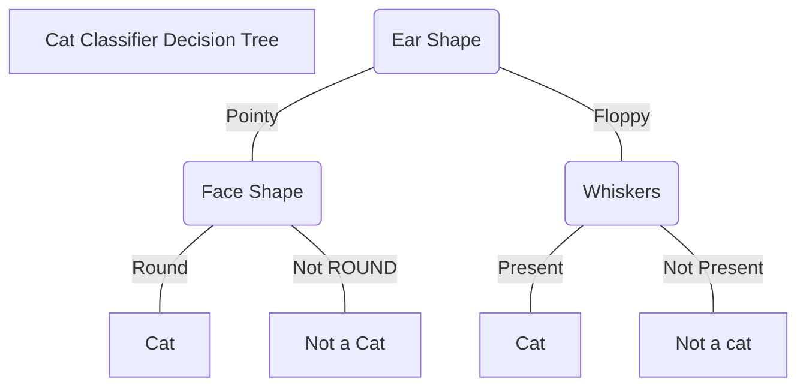
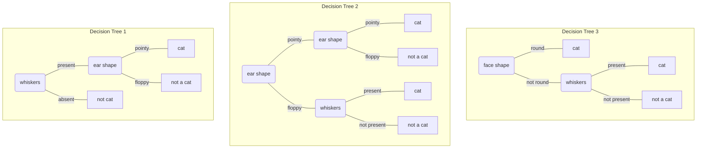

## Some Resources and Generators.

- **Logo Repository: <https://github.com/devicons/devicon/tree/master>**
- **For tables generation [Markdown Tables Generator](https://www.tablesgenerator.com/markdown_tables) and [Excel to HTML](https://tableconvert.com/excel-to-html)**
- **ASCII Diagrams Generator: <https://asciiflow.com/#/>**
- For PlantUML Diagrams: <https://www.planttext.com/>
- For Mermaid Diagrams: <https://mermaid.live/edit> and Documentation: <https://mermaid.js.org/intro/>
- **[Equation to Latex](https://editor.codecogs.com/)**
- **[Markdown Emojis](https://gist.github.com/rxaviers/7360908)**
- **[ASCII Text Generator](https://patorjk.com/software/taag/#p=display&f=Graffiti&t=Type%20Something%20)** 
ANSI Figlet fonts are the best

```bash
# ANSI Shadow

██╗  ██╗███████╗██╗     ██╗      ██████╗     ███╗   ███╗ █████╗ ███████╗████████╗███████╗██████╗     
██║  ██║██╔════╝██║     ██║     ██╔═══██╗    ████╗ ████║██╔══██╗██╔════╝╚══██╔══╝██╔════╝██╔══██╗    
███████║█████╗  ██║     ██║     ██║   ██║    ██╔████╔██║███████║███████╗   ██║   █████╗  ██████╔╝    
██╔══██║██╔══╝  ██║     ██║     ██║   ██║    ██║╚██╔╝██║██╔══██║╚════██║   ██║   ██╔══╝  ██╔══██╗    
██║  ██║███████╗███████╗███████╗╚██████╔╝    ██║ ╚═╝ ██║██║  ██║███████║   ██║   ███████╗██║  ██║    
╚═╝  ╚═╝╚══════╝╚══════╝╚══════╝ ╚═════╝     ╚═╝     ╚═╝╚═╝  ╚═╝╚══════╝   ╚═╝   ╚══════╝╚═╝  ╚═╝    
                                                                                                     
 ██████╗███████╗███████╗ █████╗ ██████╗                                                              
██╔════╝██╔════╝██╔════╝██╔══██╗██╔══██╗                                                             
██║     █████╗  ███████╗███████║██████╔╝                                                             
██║     ██╔══╝  ╚════██║██╔══██║██╔══██╗                                                             
╚██████╗███████╗███████║██║  ██║██║  ██║                                                             
 ╚═════╝╚══════╝╚══════╝╚═╝  ╚═╝╚═╝  ╚═╝                                                  

```

## Insert Images

- **Insert Image**
```html
<br>
<center>


</center>
<br>
```

<details>
<summary><strong>Insert Images side by side</strong></summary>

```html
<center>

<p align="center">
  
   
  <h1>C and C++ Language Notes</h1>
</p>

</center>

```

</details>


<details>
<summary><strong>Insert Images to the side</strong></summary>

```html
<div>
    <p style="float: left;"></p>
    <p></p>
</div>
```

> image to the side doesn't work on GitHub, and instead, two columns in a table should be used. Example below

```html
<table style="width:100%" border="0">
<tr><td style="width:30%"></td><td>

Words here, image above. Edit 30% field for image sizing

</td></tr></table>
```

# Advanced Markdown
## Expandable Content

Use `<details>` and `<summary>` HTML tags to create an expandable drop down. Example below

<details><summary><strong>Toggle me!</strong></summary>Peek a boo!</details>

Works like this.
```html
<details><summary>Toggle me!</summary>Peek a boo!</details>
```

> add `<strong>` and `</strong>` tags to bold the drop down title

## Math with Latex

Use `$` for inline latex and `$$` for a Latex block. This works for **Wiki.js**, **VS Code** (using the Markdown Preview Enhanced Extension), and **GitHub**

$$
J(\vec{w}, b) = -\frac{1}{n}\sum_{i=1}^{n}[y^{(i)}\log(f_w,_b (\vec{x}^{(i)})) + (1 - y^{(i)})\log(1 - f_w,_b (\vec{x}^{(i)}))]
$$

<br>

For **GitHub** especially, latex support seems to be a little sensitive, and to get full support, use `math` highlighting with a qouted code block.

```math
J(\vec{w}, b) = -\frac{1}{n}\sum_{i=1}^{n}[y^{(i)}\log(f_w,_b (\vec{x}^{(i)})) + (1 - y^{(i)})\log(1 - f_w,_b (\vec{x}^{(i)}))]
```

> Note that using `math` highlighting with a quoted code block does not work in **Wiki.js**

General guidelines
- Use a newline between regular text and `$$` block
- With matrices, try to not use too many new lines

<br>
<br>

# Diagrams
Use either `plantuml` or `mermaid` diagrams



## Pie Chart


## Decision Tree Like
**Diagram with Title**


**Multiple Diagrams**




## Obsidian Specific
### Canvas
Main page: <https://obsidian.md/canvas>

